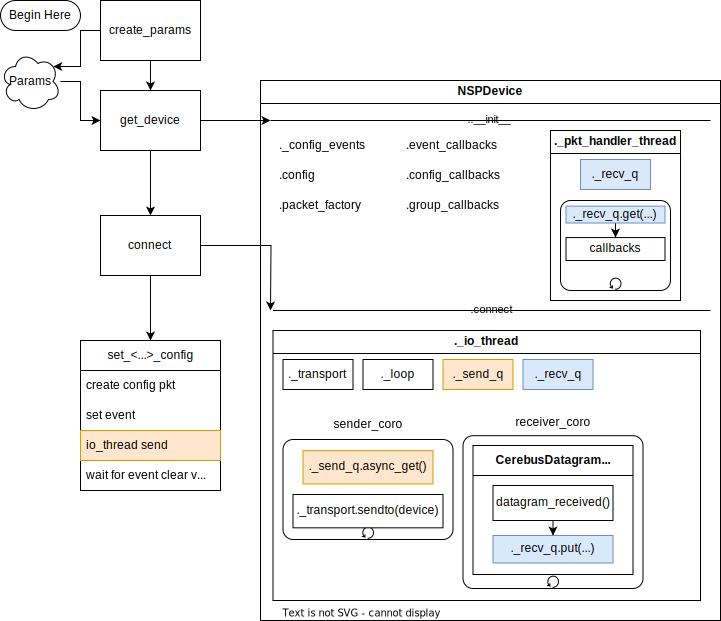

[](https://badge.fury.io/py/pycbsdk)

# pycbsdk

Pure Python package for communicating with Blackrock Cerebus devices

## Quick Start

From a shell...

```shell
pip install pycbsdk
```

Then in python

```Python
from pycbsdk import cbsdk


params_obj = cbsdk.create_params()
nsp_obj = cbsdk.get_device(params_obj)  # NSPDevice instance. This will be the first argument to most API calls. 
runlevel = cbsdk.connect(nsp_obj)  # Bind sockets, change device run state, and get device config.
config = cbsdk.get_config(nsp_obj)
print(config)
```

You may also try one of the provided test scripts

* `python -m pycbsdk.examples.print_rates` or via the entrypoint `pycbsdk-rates`.
* `python -m pycbsdk.examples.comments`

## Introduction

`pycbsdk` is a pure Python package for communicating with a Blackrock Neurotech Cerebus device. It is loosely based on Blackrock's `cbsdk`, but shares no code nor is `pycbsdk` supported by Blackrock.

`pycbsdk`'s API design is intended to mimic that of a C-library. Indeed, a primary goal of this library is to help prototype libraries in other languages. After all, Python is a poor choice to handle high throughput data without some compiled language underneath doing all the heavy lifting.

However, it's pretty useful as is! And so far it has been good-enough for some quick test scripts, and it even drops fewer packets than CereLink. So, please use it, and contribute! We are more than happy to see the API expand to support more features, or even to have an additional "pythonic" API.

## Design



Upon initialization, the `NSPDevice` instance configures its sockets (but no connection yet), it allocates memory for its mirror of the device state, and it registers callbacks to monitor config state.

When the connection to the device is established, two threads are created and started:
* `CerebusDatagramThread`
  * Makes heavy use of `asyncio`
    * A Receiver Coroutine retrieves datagrams, slices into generic packets, enqueues them in the receiver queue
    * A Sender Coroutine monitors a sender queue and immediately sends found packets.
* `PacketHandlerThread`
  * Monitors the receiver queue.
  * Updates device state (e.g., mirrors device time)
  * Materializes the generic packets into specific packets.
  * Calls registered callbacks depending on the packet type.

`connect()` has `startup_sequence=True` by default. This will cause the SDK to attempt to put the device into a running state. Otherwise, it'll stay in its original run state.

After the connection is established, the client can use API functions to:
* Get / Set config
  * `set_config` and `set_channel_config` do not do anything yet
  * `set_channel_spk_config` and `set_channel_config_by_packet` do things and are blocking.
  * `get_config` is non-blocking by default and will simply read the local mirror of the config. However, if `force_refresh=True` is passed as a kwarg, then this function will block and wait for a reply from the device. Use this sparingly.
* Register a callback to receive data as soon as it appears on the handler thread.
  
This and more should appear in the documentation at some point in the future...

## Limitations

* This library takes exclusive control over the UDP socket on port 51002 and thus cannot be used with Central, nor any other instance of `pycbsdk`. You only get one instance of `pycbsdk` _or_ Central per machine.
  * [CereLink](https://github.com/CerebusOSS/CereLink)'s cerebus.cbpy uses shared memory and therefore can work in parallel to Central or other cbpy instances.
* The API is sparse but is filling out over time. Use the issue tracker to make requests for features that you need.
* For now, our dependencies are not compatible with NoGIL Python 3.13. This means that despite using threading, if your callback functions are slow and hold up the PacketHandlerThread, this could hold up datagram retrieval and ultimately cause packets to be dropped.
* Socket configuration is still finicky and platform-specific. On Windows you might need to supply the address of the local adapter pycbsdk is binding (e.g., `--client-addr 192.168.137.198`), but on MacOS you must bind `INADDR_ANY`, or `--client-addr 0.0.0.0`, which is the default in most cases and can be omitted.
